# Home Lab : Réseau & Sécurité

Projet personnel monté dans le cadre de ma formation en Administration Systèmes et Réseaux. L'idée de départ était simple : reproduire une infrastructure d'entreprise chez moi, avec une vraie segmentation réseau, un VPN site-à-site fonctionnel, et des outils de supervision dignes de ce nom, le tout sans matériel dédié.

L'infra tourne sur deux machines physiques sous VMware Workstation. Le site "Siège" héberge un Proxmox en nested virtualisation avec pfSense, un LXC Docker pour les outils de monitoring, et un tunnel WireGuard vers le site "Agence" simulé sur la deuxième machine.

---

## Table des Matières

1. [Environnement & Architecture](#1-environnement--architecture)
2. [Pourquoi une vNIC par zone ?](#2-pourquoi-une-vnic-par-zone-)
3. [Plan d'adressage](#3-plan-dadressage)
4. [pfSense — Configuration](#4-pfsense--configuration)
5. [Stack de supervision (Docker)](#5-stack-de-supervision-docker)
6. [VPN WireGuard site-à-site](#6-vpn-wireguard-site-à-site)
7. [Règles de filtrage](#7-règles-de-filtrage)
8. [Ce qui reste à faire](#8-ce-qui-reste-à-faire)
9. [Ce que ce projet m'a appris](#9-ce-que-ce-projet-ma-appris)

---

## 1. Environnement & Architecture

Tout tourne sur deux machines personnelles, pas sur du vrai matériel réseau.

**Machine principale (Siège) :** VMware Workstation avec Proxmox VE en nested virtualisation. Les VMnets VMware en mode Host-only assurent l'isolation L2 entre les zones  les Linux Bridges Proxmox (`vmbr0`, `vmbr1`) s'appuient directement dessus. À l'intérieur tourne pfSense Siège et un LXC non-privilégié qui héberge la stack Docker.

**Machine secondaire (Agence) :** VMware Workstation avec pfSense Agence directement, plus un client Debian simulant un poste utilisateur.

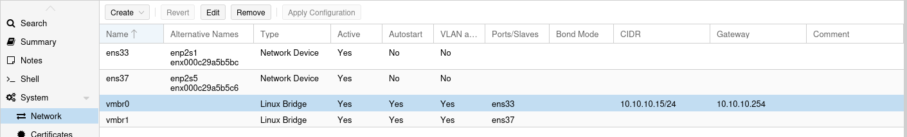

*Bridges Proxmox (`vmbr0`, `vmbr1`) mappés sur deux interfaces VMware distinctes  isolation L2 garantie au niveau hyperviseur.*

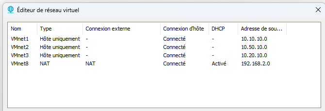

*VMnets VMware en mode Host-only : chaque zone réseau a sa propre interface isolée.*

[→ Architecture détaillée dans `docs/ARCHITECTURE.md`](./docs/ARCHITECTURE.md)

---

## 2. Pourquoi une vNIC par zone ?

En environnement virtualisé, faire passer plusieurs VLANs sur une seule interface (mode trunk) peut poser un problème : certains hyperviseurs gèrent mal les tags 802.1Q, ce qui peut créer des fuites entre zones (VLAN hopping). Un service compromis en DMZ pourrait théoriquement atteindre le LAN admin sans passer par le pare-feu.

Pour éviter ça, j'ai choisi de dédier une interface physique virtuelle (vNIC) à chaque zone réseau plutôt que de faire du trunk. Chaque bridge Proxmox est isolé des autres au niveau VMware, c'est plus rigide à configurer mais bien plus sûr.

- **Approche trunk (abandonnée) :** 1 vNIC + tags VLAN → risque de fuite entre zones
- **Approche retenue :** 1 vNIC dédiée par zone → isolation garantie au niveau hyperviseur

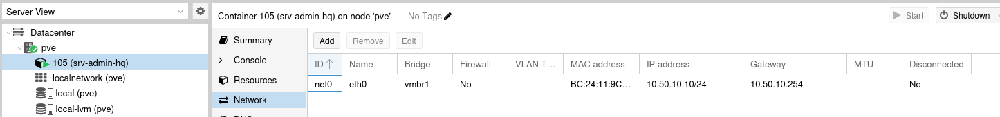

*Le LXC `srv-admin-hq` est bien en `10.50.10.10/24` sur `vmbr1`, isolé du LAN admin.*

---

## 3. Plan d'adressage

J'ai utilisé la logique `10.SITE.x.x` pour que les IPs soient lisibles sans avoir à consulter un document à chaque fois.

| Zone | Réseau | Gateway | Machines |
| :--- | :--- | :--- | :--- |
| LAN Siège | `10.10.10.0/24` | `10.10.10.254` | Proxmox : `10.10.10.15` |
| DMZ Siège | `10.50.10.0/24` | `10.50.10.254` | srv-admin-hq (Docker) : `10.50.10.10` |
| LAN Agence | `10.20.10.0/24` | `10.20.10.254` | Client Debian : `10.20.10.130` |
| Tunnel VPN | `10.10.20.0/24` | — | Peer Siège : `.1` / Peer Agence : `.2` |

---

## 4. pfSense : Configuration

pfSense est le cœur du réseau sur les deux sites. Il gère le routage inter-zones, le filtrage, la terminaison WireGuard et les services réseau de base.

### Interfaces (Siège)

| Interface | IP | Zone | Rôle |
| :--- | :--- | :--- | :--- |
| `em0` (WAN) | DHCP | Non fiable | Accès Internet simulé via NAT VMware |
| `em1` (LAN) | `10.10.10.254/24` | Admin | Gestion, accès complet |
| `em2` (SECOPS_DMZ) | `10.50.10.254/24` | DMZ | Services Docker, monitoring |
| `tun_wg0` (VPN) | `10.10.20.1/24` | Overlay | Tunnel WireGuard vers l'Agence |

### Règles Zero Trust : DMZ

La règle fondamentale : la DMZ ne peut jamais initier de connexion vers le LAN admin. Un service compromis en DMZ reste bloqué.

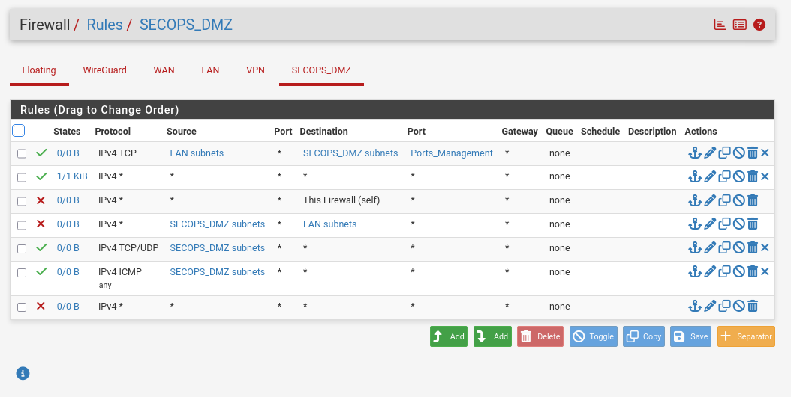

*BLOCK DMZ → LAN et BLOCK DMZ → This Firewall, la DMZ est isolée du réseau admin.*

Les aliases pfSense centralisent les définitions de ports et d'IPs pour rendre les règles lisibles et maintenables :

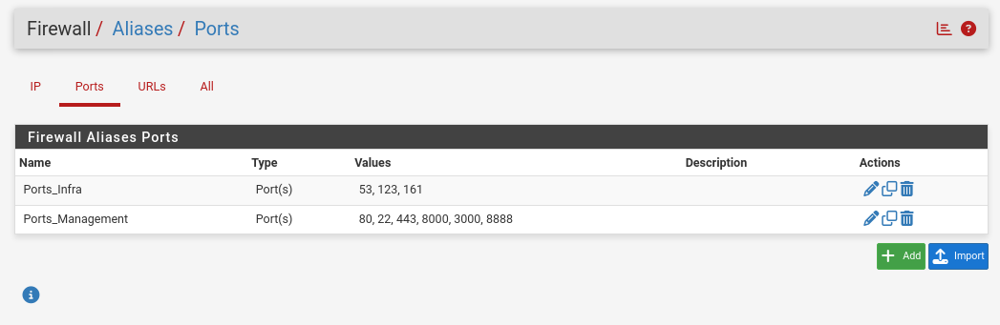

*`Ports_Management` et `Ports_Infra`, les ports sont définis une seule fois et réutilisés dans toutes les règles.*

### Optimisations kernel

En environnement virtualisé imbriqué, j'ai désactivé le TCP Segmentation Offload (TSO) et le Large Receive Offload (LRO), ces deux options peuvent causer des corruptions de paquets avec certains drivers paravirtualisés.

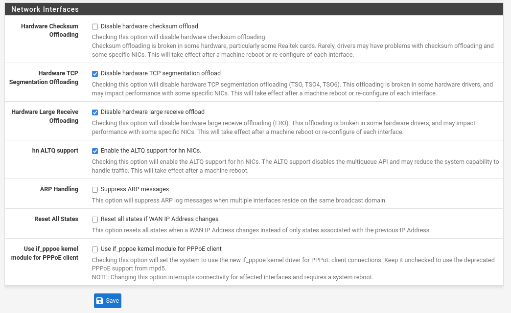

### Autres services

- **DNS (Unbound)** en mode récursif avec host overrides pour `librenms.homelab.lan` et `netbox.homelab.lan`

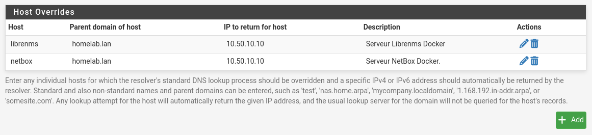

- **Auto Config Backup** : sauvegarde chiffrée AES-256 automatique de la config pfSense

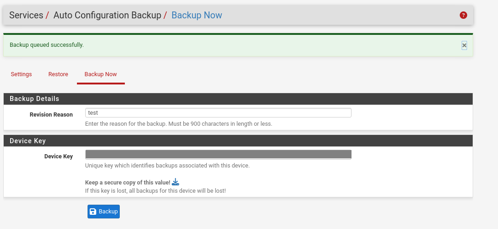

- **SNMP** actif sur LAN et VPN uniquement, community string dédiée

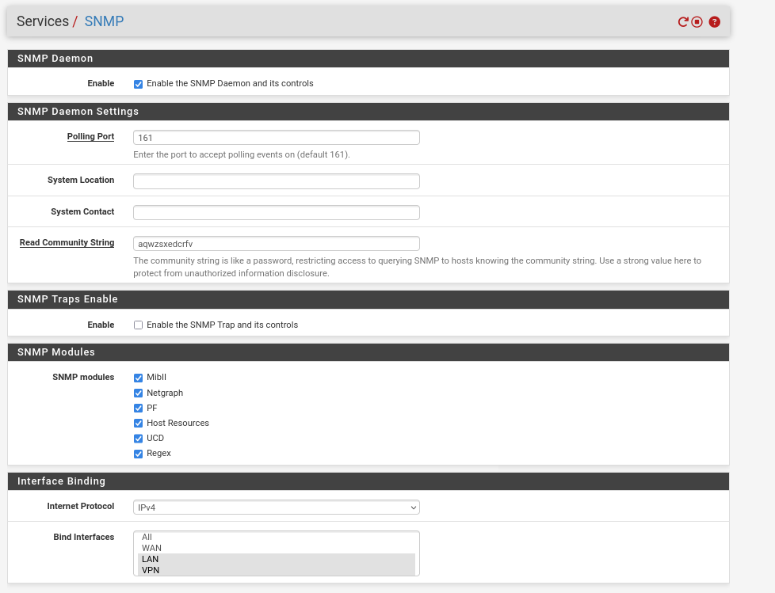

*SNMP bindé sur LAN et VPN uniquement, pas exposé sur le WAN.*

---

## 5. Stack de supervision (Docker)

Tous les outils de monitoring tournent en conteneurs Docker dans un LXC non-privilégié sur Proxmox.

| Service | Rôle | Port |
| :--- | :--- | :--- |
| **NetBox** | Inventaire réseau (IPAM, CMDB) | `8000` |
| **LibreNMS** | Supervision SNMP, graphes, alerting | `80` |
| **Oxidized** | Backup automatique des configs routeurs avec versioning Git | `8888` |
| **Cloudflared** | Tunnel Cloudflare Zero Trust, accès distant sans port public ouvert | — |

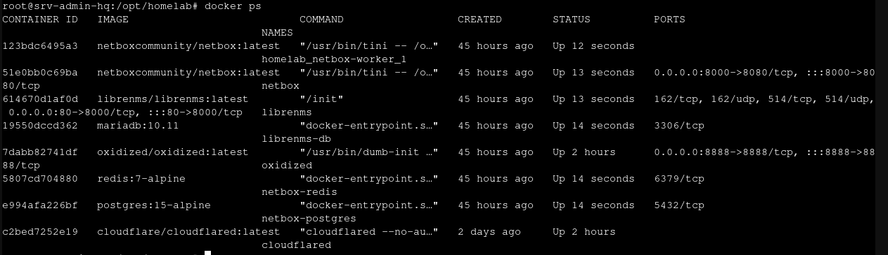

*Tous les conteneurs up, NetBox, LibreNMS, Oxidized, Cloudflared, et leurs dépendances.*

**ntopng** est installé différemment : c'est un package natif pfSense sur le site Agence, pas dans Docker. Ça lui permet d'analyser tout le trafic directement sur le firewall avant le routage.

[→ Voir le `docker-compose.yml`](./DOCKER_STACK/docker-compose.yml)

---

## 6. VPN WireGuard site-à-site

J'ai choisi WireGuard plutôt qu'IPsec ou OpenVPN pour plusieurs raisons :

- **Codebase réduite** (~4 000 lignes vs des centaines de milliers pour IPsec), moins de surface d'attaque
- **Cryptographie moderne** : ChaCha20-Poly1305 + Curve25519
- **Furtivité** : WireGuard ne répond pas aux paquets non authentifiés
- **Performance** : kernel space, latence bien plus faible qu'OpenVPN

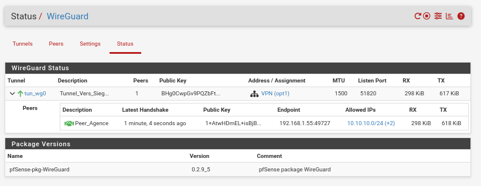

*Tunnel up, handshake actif il y a 1 minute, trafic bidirectionnel (298 KiB RX / 617 KiB TX).*

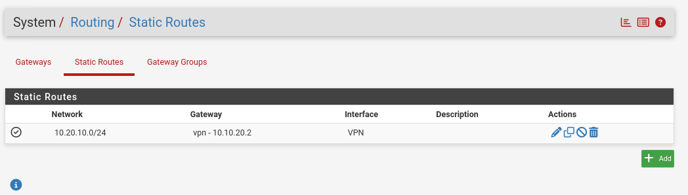

*Route statique `10.20.10.0/24` via `vpn-10.10.20.2`, le Siège sait comment joindre l'Agence via le tunnel.*

**Validation : traceroute Siège vers Agence :**

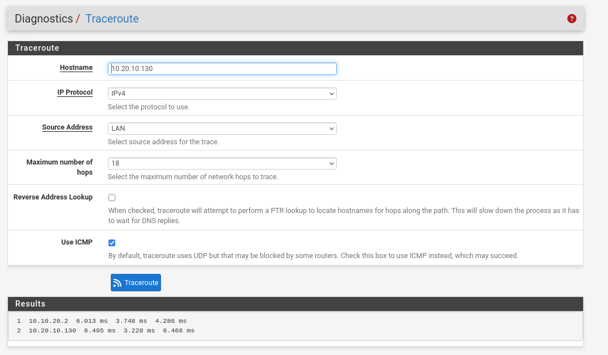

*2 sauts : pfSense Siège → pfSense Agence via WireGuard. Le tunnel est fonctionnel.*

**Validation : traceroute LAN vers DMZ avec résolution DNS :**

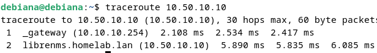

*`librenms.homelab.lan` se résout correctement en `10.50.10.10` via Unbound.*

**Validation : accès cross-site depuis l'Agence :**

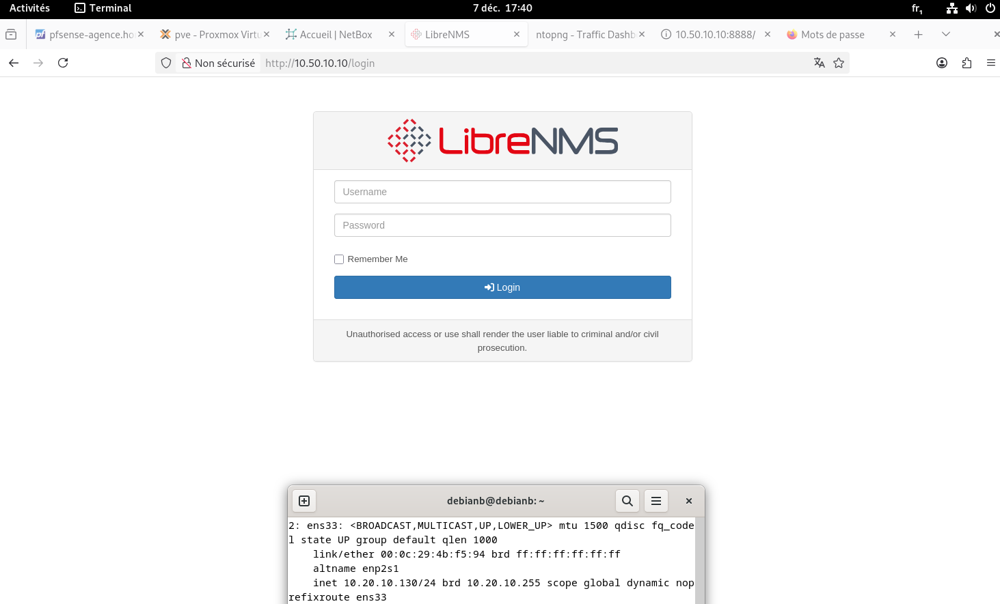

*Le client Agence (`10.20.10.130`) accède à LibreNMS sur `10.50.10.10` via le tunnel WireGuard.*

---

## 7. Règles de filtrage

Politique de base : **default deny** , tout ce qui n'est pas explicitement autorisé est bloqué.

| Interface | Source | Destination | Port | Action | Pourquoi |
| :--- | :--- | :--- | :--- | :---: | :--- |
| WAN | Any | WAN | UDP/51820 | ✅ Pass | Tunnel WireGuard entrant |
| LAN | LAN | DMZ | Ports_Management | ✅ Pass | Accès aux outils depuis le LAN admin |
| LAN | LAN | pfSense | 53 | ✅ Pass | DNS interne uniquement |
| LAN | LAN | !RFC1918 | Any | ✅ Pass | Internet, mais pas les autres réseaux privés |
| DMZ | DMZ | pfSense | Any | ❌ Block | La DMZ n'accède pas à l'interface de gestion |
| DMZ | DMZ | LAN | Any | ❌ Block | Règle principale : DMZ ne peut pas initier vers le LAN |
| DMZ | DMZ | Internet | Any | ✅ Pass | Mises à jour, images Docker |
| WireGuard | serveur_librenms | LAN Agence | UDP/161 | ✅ Pass | Pull SNMP depuis LibreNMS uniquement |
| WireGuard | Any | Any | Any | ❌ Block | Tout le reste bloqué |

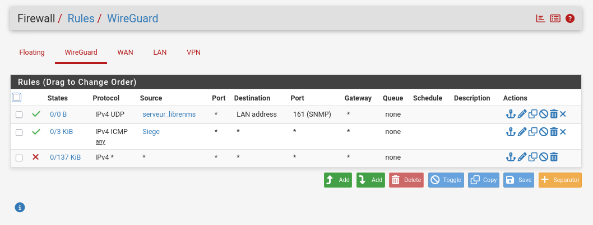

*Seul `serveur_librenms` (`10.50.10.10`) peut interroger le SNMP de l'Agence, principe du moindre privilège.*

[→ Matrice de flux complète dans `docs/FIREWALL_RULES.md`](./docs/FIREWALL_RULES.md)

---

## 8. Ce qui reste à faire

**Court terme**
- Désactiver l'auth SSH par mot de passe sur pfSense (clés Ed25519 déployées via Ansible)
- Migrer SNMP vers la v3 (auth SHA + chiffrement AES)
- Corriger l'ordre des règles sur l'interface DMZ (remonter les BLOCK)
- Supprimer la "Default allow LAN to any rule" résiduelle
- Activer Grafana et connecter LibreNMS

**Moyen terme**
- Intégrer ntopng dans Grafana
- Remplir NetBox à 100%
- Configurer les alertes LibreNMS (VPN down, espace disque)
- Push automatique des configs Oxidized vers GitHub

**Plus ambitieux**
- Proxmox SDN avec VXLAN
- NAC 802.1X avec RADIUS
- Cluster pfSense actif/passif (CARP + pfsync)

---

## 9. Ce que ce projet m'a appris

Au-delà de la technique, ce qui m'a le plus apporté c'est d'avoir résolu de vrais problèmes, pas des exercices sur papier.

La gestion des tags VLAN en environnement nested m'a forcé à comprendre pourquoi le trunk peut être dangereux dans ce contexte. Débugger un SNMP qui ne remontait pas m'a appris à lire les règles firewall dans le bon sens. Mettre en place WireGuard et valider avec des traceroutes m'a donné une vraie compréhension du routage inter-sites.

**Réseau & Sécurité**
- Segmenter un réseau avec des zones de confiance différentes et les faire cohabiter correctement
- Configurer pfSense avec des règles précises et une politique default deny réelle
- Déployer WireGuard site-à-site et comprendre pourquoi le routage statique est suffisant ici
- Identifier et mitiger les risques liés à la virtualisation imbriquée

**Supervision & Ops**
- Mettre en place LibreNMS avec supervision SNMP, graphes et alerting
- Utiliser NetBox comme inventaire réseau centralisé
- Versionner des configurations réseau avec Oxidized
- Orchestrer des services avec Docker Compose dans un LXC contraint

**Automatisation**
- Écrire des playbooks Ansible pour auditer et durcir des équipements réseau
- Déployer des clés SSH via Ansible
- Mettre en place un pipeline CI/CD pour valider les fichiers de config (GitHub Actions)
